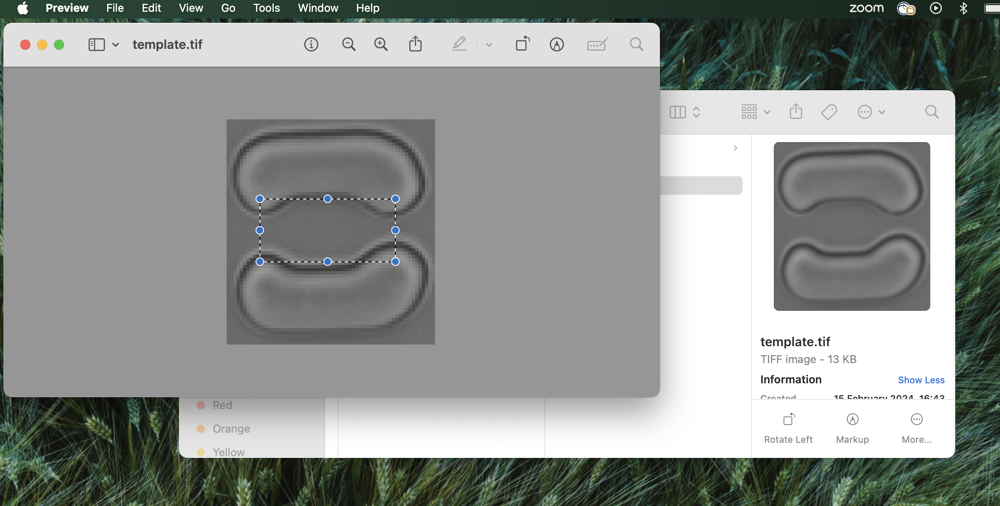

# Introduction:

This is a data analysis pipeline that takes in a stack of tiff images of yeast
microscopy (bright-field) and fluorescence data, and provides data structures containing :
- smaller movies, pieces of the bigger movie broken by microfluidic trap
- segmentation of those smaller movies using YeaZ2 model allowing to get object outlining individual cells
- tracking of segmented cells using btrack
- heuristic detection of the mother cell for each trap
- extraction of the fluorescence data for each mother cell
- summary plots for each trap

The pipeline contains the midap tool that also allows manual correction of both segmentation and tracking.

The pipeline was originally written by Nadia Marounina and Tarun Chadha at ETH
Zurich's Scientific IT Services; see [Credits](#credits) below for who did what,
and [Licence](#licence) for the terms it is available under.

Please report bugs and other issues through the GitHub issue tracker. For
anything that needs a person, the contact for the pipeline is **Tom Peskett**
(thomaspeskett@googlemail.com).

# Installation:

How to install and run the pipeline with the provided example:

Create and activate the conda environment :

`git clone https://github.com/OWNER/REPO.git`

`cd yeast_segtrack_pipeline`

`conda env create --file=environment.yml`

`conda activate segtrack`

Download the weights for the YeaZ model and point the `.env` file at them.

The published weights are linked from https://github.com/rahi-lab/YeaZ-GUI:

- bright-field: https://drive.google.com/file/d/1vnhkp54McM836yczh4F-YYJwPahbTsY0
- phase contrast: https://drive.google.com/file/d/1tcdl34Aq11mrPVlyu0Qd4rUigw_6948b
- fission yeast: https://drive.google.com/file/d/1h_Wz2d3UY0jkGtMrhl32iEqbOQVXsmKS

The movies this pipeline was developed on are bright-field, so the bright-field
weights are the ones to start from.

**Which weights produced the results reported by the authors.** Not these. We
used `weights_budding_BF_multilab_0_1`, a bright-field model from a
multi-laboratory YeaZ retraining effort that is not yet published and that we
are not in a position to redistribute. The pipeline does not depend on it - it
loads any YeaZ UNet checkpoint - but segmentation quality on your own movies
will differ from ours, and the example run below will not reproduce our output
exactly. Use the public bright-field weights above, or fine-tune your own
checkpoint on your imaging condition (see `retrain/README.md`).

The `.env` file must exist and must contain the path to the weights. It is not
in the repository, because the path is particular to your machine; copy
`.env.example` to `.env` and edit it, or generate it in place:

`echo "WEIGHTS_YEAST=$(pwd)/weights/<the-file-you-downloaded>" > .env`

Without it the pipeline cannot find the weights and the segmentation step stops
with a `FileNotFoundError` naming the path it tried.

Create the folder for the output data:

`mkdir output`

Install midap :

`git clone https://github.com/Microbial-Systems-Ecology/midap.git`

`cd midap` 

`pip install -e .`

Run the example provided in the repo:

 `cd ..`

 `python main.py -i ./input/small_movie.tif -t ./input/template.tif -tx 41 -ty 21`

On a 2022 MacBook Pro with Apple M2 chip it takes ~2.5 min to complete the test run.

The segmentation runs on a GPU when one is available: CUDA first, then Apple's
Metal (`mps`) on Apple-silicon Macs, and the CPU otherwise. The log line
`Running the neural network on ...` reports which one was chosen. Metal is
roughly 14x faster than the CPU for the same output, so on a Mac it is worth
checking that line says `mps` rather than `cpu`.

## To analyse another tif movie: 

### The input movie :
The expected format is a 3D stack of images in tif format, the 3rd dimension being the time. 
The stack can contain single fluorescence images in between two bright-field images (Z-stack in fluorescence are not yet handled).
Fluorescence images has to be regularly spaced withing the stack, but they can start anytime within it,
e.g. there is a fluorescence image every 8 frames, starting from the frame 21; 
in the example movie, there is a fluorescence frame every 6 frames, starting at the frame num. 10.

### Mandatory input arguments :
The only argument you have to give is:
- -i, the path to the input tif movie

Everything else is worked out from the movie, and printed as it goes.

### Fluorescence frames :
The pipeline works out which frames hold fluorescence images by itself, and
prints what it found, e.g. `Found 3 fluorescence frames (offset 9, step 6)`.
A fluorescence frame looks nothing like a bright-field one - on the example
movies the per-frame median is ~640 against ~28300, while the bright-field frames
agree with each other to better than 1% - so the two sorts of image separate
cleanly. A movie with no fluorescence in it is recognised as such and simply
treated as bright-field throughout.

**Check the printed line.** Getting these numbers wrong is quiet and damaging:
the wrong frames get overwritten, and every later step works on the wrong data.
If the detection is ever wrong you can still say what the answer is:

- -fo is the "fluorescence offset" parameter, the number of frames between the
  beginning of the movie and the first fluorescence image
- -fs is the "fluorescence step" parameter, the spacing of fluorescence frames

Either overrides the detected value, and the pipeline says so when it uses yours
instead of its own. If the fluorescence frames turn out not to be evenly spaced,
a warning is printed with the frames that were found, since a single offset and
step cannot then describe them.

### Optional input arguments :
The entire pipeline, with all steps runs as the default behavior. To exclude some steps from the pipeline please add one or several of the following flags :

- -no_s --no_segmentation : Exclude the segmentation step from the pipeline
- -no_fm --no_format_midap : Exclude the formatting of the data for midap
- -no_tr --no_tracking : Exclude the tracking step
- -no_m --no_mother : Exclude the detection of the mother cell
- -no_fl --no_fluor : Exclude the treatment of the fluorescence frames

- -t expects a path to the template. If this argument is omitted, it will prompt the creation of a template

- -cc --cell_correspondence : run YeaZ's frame-to-frame label matching during
  segmentation. Off by default. It renumbers cells so that a label means the same
  cell from one frame to the next, but nothing in this pipeline uses that: btrack
  re-tracks from the raw masks, and the fluorescence, mother-cell and summary
  steps only ever match a label within a single frame. It is also expensive - a
  pure-Python Hungarian match plus a full-image pass per cell, on ~150 cells a
  frame, which costs more than the neural network itself. Turning it off leaves
  the segmented cell shapes byte-identical and every downstream result unchanged
  (verified on the example movie: same tracks, same mother traces, same summary);
  only the label *numbers* differ. Switch it on if you add a step that needs a
  label to mean the same cell across frames.

- -ma --min_cell_area : minimum size, in px, for a segmented object to be kept
  (default 50). The segmentation produces a tail of very small fragments -
  slivers shaved off a cell edge, specks of debris - which are a small share of
  the pixels but a large share of the *objects*, and each one is a link the
  tracker has to explain. Removing them cuts the number of spurious one- and
  two-frame tracks by about half. Raise it if you still see debris being
  tracked; lower it (or set 0 to disable) if genuinely small cells are being
  dropped.

### The trap template :
By default the template is the one you give with -t, or one you crop by hand if
you give neither -t nor -at, exactly as before.

`-at` builds a template from the movie instead. By the time it runs the movie has
been segmented, so the cells are known: each pixel is replaced by its median over
the frames in which no cell covered it, giving a picture of the device with the
cells taken out. The traps are a periodic array, so their spacing comes out of
the autocorrelation of that picture - tilt included, which is what makes a
hand-made template non-transferable between movies. The template is then the
median over every trap in the image, so a cell or a speck of dirt on any one trap
is not in it: they are never in the same place twice. Matching is done against
the background rather than a single frame, so a cell sitting on a trap cannot
stop it being found. The template and the background are written to the run
folder alongside `detected_traps_using_*.png`.

**It is off by default because it is not yet as good as a hand-cropped one.** It
finds the traps just as well (all of them, peak match 0.96, and on the 364 frame
movie one more than the manual template found), but it does not centre on the
trap as accurately - about 10 px out on the example device - and the trap crops
are then off centre too. On the 25 frame example that costs mother traces: a
median of 13 frames against 18 for the hand-cropped template. Centring on the
structure's centre of mass, on where the cells sit, and on the structure's
bounding box were all tried and were all worse; the code records why.

### The trap centre (-tx / -ty) :
The box that decides which cells count as trapped is measured from the movie: the
longest-lived cell in each trap is the one the trap is holding, and the box is
sized to contain where those cells sit, with a floor of one cell diameter.

Note that it is track *length* that identifies a held cell, not how still it sits
- a trapped mother's centroid drifts 10-30 px over a long movie as the cell
grows, while debris lodged in a corner sits perfectly still.

`trap_centre_check.png` in the run folder shows the template with the box drawn
on it, which is worth a look. Pass -tx and -ty to override.

On the test movies the measured box matched or beat the hand-measured one: on the
364 frame movie it came out 40x40 against a hand-measured 39x21, and gave a
median mother trace of 260 frames against 239.

### How to proceed if no template is available for a given movie ?
You will have to run the pipeline in two steps.

You can run with -at, which builds a template from the movie and needs no second
run - but see the caveat above. Otherwise:

First, run the segmentation and tracking steps, excluding the post-treatment steps:

`python main.py -i ./input/small_movie.tif -no_m -no_fl`

Next, you would need to determine the size of the center of the trap.
To do so, open the template image in Preview and try selecting a rectangle with your mouse, as shown here :

It was not possible to capture it with a screenshot, but as long as one toggles with the size of the rectangle, 
one can see its dimensions, in pixels. Those are the numbers that you will have to save for the -tx -ty arguments in the next step.

Run the second command by excluding the steps that have already run :

`python main.py -i ./input/small_movie.tif -t ./output/<timestamp>/<template_name>.tif -fo 9 -fs 6 -tx <the_right_value> -ty <the_right_value> -no_s -no_fm -no_tr`

# Detail of inputs/outputs of each step of the pipeline:
- Step 1 : does the segmentation of the movie
  - Each fluorescence frame is replaced by the bright-field frame before it
    *first*, and only then is the movie segmented, so the network never sees a
    fluorescence frame. Segmenting them produced nonsense (on the example movie,
    4 objects on one fluorescence frame and 0 on another, against ~130 real
    cells), and that nonsense then became the frame that YeaZ matched the next
    bright-field frame against. The duplicated frames are copied rather than
    re-segmented, which also saves one network pass per fluorescence frame.
  - in : tiff movie in ./input folder (example: mymovie.tif)
  - out :
    - a tif movie where the fluor frames has been overwritten (./output/mymovie_no_fluor.tif)
    - a h5 file where the fluor frames has been overwritten (./output/mymovie_no_fluor.h5)
    - the same h5 copied to the ./input folder (mymovie.h5) for the later steps
    
- Step 2 : separates the traps from the movie 
  - in : no_fluor tif and h5 files from previous step, optional : a template for a trap. If template is not provided, a creation of such template will be prompted.
  - out : folders in ./output/<timestamp>/split_data, one for each trap detected in the original movie. Each folder contains a tif and h5 files representing the cropped movie and the cropped segmentation data or a given trap

- step 3 : adapts the output format for midap 
  - in : system of folder and files created by the previous step
  - out : 
    - shift-corrected movie, saved as ./output/<timestamp>/split_data/<trap_number>/shift_corrected.tif where the traps are centered and the "drift" of the move has been compensated for
    - an additional folder, ./output/<timestamp>/split_data/<trap_number>/midap, containing two folders : cut_im and seg_im, where the movie and segmentation data are broken by frame and stored in png and tif formats, respectively.

- step 4 : tracking
  - The fluorescence frames are withheld from the tracker and restored
    afterwards. A fluorescence image is acquired alongside a bright-field image
    rather than at a time point of its own, so its frame in the stack is a copy
    of the bright-field frame before it and carries no new information - but the
    tracker cannot know that, and hands cells' identities to their neighbours
    when it sees them all hold still for one step. Measured on the 364 frame test
    movie, track starts were 1.5x over-represented on the frame straight after a
    fluorescence frame before this change and at chance after it. Each withheld
    frame simply inherits the assignment of the frame it was copied from.
  - in : ./output/<timestamp>/split_data/<trap_number>/midap folders created previously
  - out : A set of files summarising the tracking :
    - ./output/<timestamp>/split_data/<trap_number>/midap/segmentation_bayesian.h5
    - ./output/<timestamp>/split_data/<trap_number>/midap/track_output_bayesian.csv
    - ./output/<timestamp>/split_data/<trap_number>/midap/tracking_bayesian.h5
    
- step 5 : identifies the mother cell
  - The mother is the cell holding the middle of the trap, followed through the
    movie across breaks in its track. Each track's unbroken time in the trap
    centre is one segment, and two segments are joined only when the next starts
    close in both time and space to where the last ended, so a break in the
    tracker's own trackID does not end the mother trace while a genuine handover
    to another cell does. On the 364 frame test movie this raised the median
    mother trace from 219 to 239 frames, and traps whose mother trace used to
    start only at frame 200+ now start near frame 0.
  - The `mother_trackID` column records which track the mother was at each frame,
    so any stitch can be checked. Junctions should show a position jump of about
    a pixel; a larger one is worth looking at in the tracking tool.
  - in : ./output/<timestamp>/split_data/<trap_number>/midap/track_output_bayesian.csv
  - out : ./output/<timestamp>/split_data/<trap_number>/tracking_with_mother.csv
  
- step 6 : gets the fluorescence values of each mother cell
  - in : track_output_bayesian.csv, tracking_with_mother.csv, the original movie containing fluorescence data
  - out : ./output/<timestamp>/split_data/<trap_number>/tracking_with_fluor.csv, summary_trap_<trap_number>.png

# Checking the results by eye:
`./output/<timestamp>/check_segmentation_and_tracking.tiff` overlays the
segmentation on the movie. Each cell is coloured by the identity it was tracked
as, so a correctly tracked cell keeps one colour for its whole life and a
tracking error shows up as a cell *changing colour* between frames. Cells that
were segmented but belong to no tracked trap are drawn in grey.

Each trap is labelled once, pinned to the trap itself rather than to the cells in
it so the label holds still for the whole movie, and each cell carries its number
within that trap, so a cell is named "trap 9 cell 25". That pair is the `Cell_name` column of
`all_traps_summary.csv` (written as `9-25`), alongside the `Global_id` that
numbers every track in the movie in one sequence.

Where two touching cells would land on the same colour, the younger one gives
way: a mother that has held one colour for hundreds of frames keeps it when it
buds.

# Known limitations and next steps:
Tracking is now good enough that the errors left visible in the check movie are
segmentation errors, and the segmentation model wants retraining on crowded
cells and on the odd shapes old mothers take late in a long movie. See
`retrain/README.md` for the retraining loop.

# Tests:
`tests/` holds regression tests for the parts of the pipeline that are now
inferred rather than stated by the user - the fluorescence frames and the frame
arithmetic around them, and finding the traps and building a template of one.
Those are exactly the places where a wrong answer is quiet. Run them from the
repository root:

`pytest tests`

They take a few seconds and build their movies from real frames of
`input/small_movie.tif`, so they exercise the actual intensity distributions the
detection has to separate. They skip themselves if that movie is missing.

# Segmentation and tracking corrections:
Instruction on how to start the correction step for the segmentations :
https://github.com/Microbial-Systems-Ecology/midap/wiki/Manual-Correction

Instruction on how to install and use the correction step for the tracking :
https://github.com/Microbial-Systems-Ecology/midap_manual_tracking

# Miscellaneous:
- What to do if my tiff movie does not contain fluorescence images ?
  - nothing: the pipeline detects that and treats the movie as bright-field
    throughout. (-no_fl still works, and skips the fluorescence measurements on a
    movie that does have them.)

- If some segmentation images has been corrected, the tracking and post-treatment step 
- need to be re-run to update the rest of the outputs

- I have a new movie where the trap shape is the same but the movie is slightly tilted - can I reuse a template from another movie ?
  - unfortunately, no: the algorithm does not register the rotation of the
    template. -at sidesteps this by building a template from the movie itself,
    with the tilt coming out of the trap spacing, but see the caveat on -at above.

# Credits:

**Nadia Marounina** (Scientific IT Services, ETH Zurich) - *software.* Wrote the
pipeline. The original implementation, developed between November 2023 and June
2024, is hers: the segmentation step, splitting the movie by microfluidic trap,
formatting the data for midap, the tracking step, the mother-cell heuristic and
the extraction of fluorescence traces. Her commits are preserved in this
repository's history, and the structure of the pipeline is still the one she
laid down.

**Tom Peskett** - *conceptualisation, biological input, validation, later
development.* Conceived the project, supplied the biological requirements the
pipeline is built around, and tested it against real experiments. Responsible
for the development from mid-2024 onwards: automatic detection of the
fluorescence frames and the frame arithmetic around them, automatic trap
detection and template construction from the movie itself, drift correction,
stitching the mother-cell trace across breaks in tracking, withholding
fluorescence frames from the tracker, the minimum-cell-area filter, the
regression test suite in `tests/`, and the model retraining workflow in
`retrain/`.

**Tarun Chadha** ([@chadhat](https://github.com/chadhat)) - *software,
supervision.* Wrote the template matching routine, `template_matching.py`, which
is what finds the traps in a movie and makes everything downstream of it
possible. Supervised the computational side of the project throughout.

> **A note on `git blame`.** Tarun's authorship is not visible in this
> repository's history: `template_matching.py` arrived in the first commit,
> committed by Nadia, so git attributes his code to her. The history records who
> committed, which here is not the same as who wrote. This section is the
> authoritative statement of authorship, not `git log`.

The pipeline stands on three pieces of work by other groups, none of which are
redistributed here - each is installed from its own repository:

- **YeaZ** (Rahi lab, EPFL) provides the neural network that segments the cells,
  and the model weights the pipeline loads.
  <https://github.com/rahi-lab/YeaZ-GUI>
- **MIDAP** (Microbial Systems Ecology, ETH Zurich; Franziska Oschmann and Janis
  Fluri) provides the tracking step and the tools for manually correcting
  segmentation and tracking.
  <https://github.com/Microbial-Systems-Ecology/midap>
- **btrack** (Lowe lab, UCL) is the Bayesian tracking algorithm underneath.
  <https://github.com/quantumjot/btrack>

If you use this pipeline in published work, please cite it using `CITATION.cff`
in this repository, and cite YeaZ, MIDAP and btrack separately - the references
are in that file.

# Licence:

**MIT.** See [LICENSE](LICENSE) for the full text.

The pipeline was developed at ETH Zurich - the original implementation in
Scientific IT Services, the later development in the Institute of Biochemistry.
Software written during the official duties of an ETH employment belongs to ETH
Zurich, which holds the exclusive rights of use and exploitation, so the
copyright line in `LICENSE` follows the form ETH recommends: the holder of those
rights, then the authors who wrote the code, then the years. See
<https://transfer.ethz.ch/researchers/licensing-software/copyright-ownership.html>.

The licence covers the code in this repository only. YeaZ, MIDAP and btrack are
not redistributed here and carry their own licences; so do the model weights,
which are not part of this repository. The example movie in `input/` is data
rather than software, and the MIT terms sit awkwardly on it - ask before reusing
it on its own.